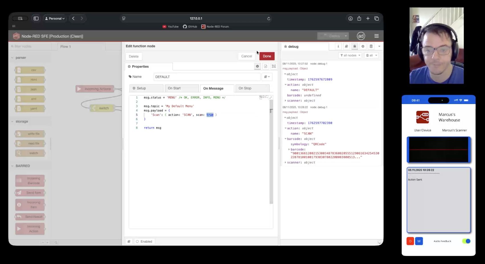

# Node RED BARRED
The Node RED Barcode Processing Platform!

Node RED BARRED is a complete, unbiased Barcode Processing Toolkit, allowing full control of the processes following a scan.

This Toolkit is in 2 parts:

- A Native Mobile Client (iOS, Android)
- The set of Node RED Nodes

The mobile application uses `on-device` barcode detection, so performance is much greater than web-based barcode scanners. 

Currently, the supported barcode symbologies are:

- iOS
  - **1D**: Codabar, Code 39, Code 93, Code 128, EAN-8, EAN-13, GS1 DataBar, ITF, UPC-A, UPC-E
  - **2D**: Aztec, Data Matrix, MicroPDF417, MicroQR, PDF417, QR Code

- Android
  - **1D**: Codabar, Code 39, Code 93, Code 128, EAN-8, EAN-13, ITF, UPC-A, UPC-E
  - **2D**: Aztec, Data Matrix, PDF417, QR Code

The set of Nodes for Node RED opens up various processing requirements and, used together, offers massive flexibility in interoperability with other systems and processes. Furthermore, the Module allows for a menu system, adding full customization of the system.

| Node | Description |
|------|-----------------|
| `Incoming Barcode` | Receives scanned barcodes |
| `Send Result` | Response to the scanner that sent the barcode |
| `Incoming Item` | Receives information responses |
| `Send Item` | Sends information to the connected scanners |
| `Incoming Action` | Receives menu requests |

In effect, this Module (along with the Native Mobile application – which is Free & Open Source) brings you a Handheld Barcode Scanning Terminal.

There is a complete flow example included with this Node RED module, but detailing how it all fits together in text is difficult, so a video walkthrough of this platform is provided below.

# Native App Build Environment
- Android SDK 15 (35)
- Java SDK 25
- DOTNET 9.0 (with MAUI payloads)
- Xcode 16.4
- Rider 2025.2.3
- macOS 26

The complete set of elements to get up and running is [here](https://github.com/marcus-j-davies/node-red-barred/tree/main/Complete%20Dist):

⚠️ **WARNING**  If you did not obtain the APK/IPA from this repository, ensure you trust the source.  
To be safe - always pull the Mobile Applications from [this](https://github.com/marcus-j-davies/node-red-barred) repo only (marcus-j-davies/node-red-barred)

- Android APK
- iOS IPA (Unsigned)
- Node RED Module (can also be installed via standard methods) 

# To Do

- Allow rich content in responses/items
- Add dropdown (select) to allowed list of input types for information requests
- Add SSL support
- Allow for deeper object formatting  
  Currently, nested objects on the scanners are not formatted

# Acknowledgements

Node RED Community members [Dynamic Dave](https://discourse.nodered.org/u/dynamicdave/summary) & [Zen Of Mud](https://discourse.nodered.org/u/Zenofmud/summary) - For helping me test out the platform  
[Afriscic](https://github.com/afriscic) - For the Native Barcode Decoding lib

# License
MIT License

Copyright (c) 2025 Marcus Davies

Permission is hereby granted, free of charge, to any person obtaining a copy
of this software and associated documentation files (the "Software"), to deal
in the Software without restriction, including without limitation the rights
to use, copy, modify, merge, publish, distribute, sublicense, and/or sell
copies of the Software, and to permit persons to whom the Software is
furnished to do so, subject to the following conditions:

The above copyright notice and this permission notice shall be included in all
copies or substantial portions of the Software.

THE SOFTWARE IS PROVIDED "AS IS", WITHOUT WARRANTY OF ANY KIND, EXPRESS OR
IMPLIED, INCLUDING BUT NOT LIMITED TO THE WARRANTIES OF MERCHANTABILITY,
FITNESS FOR A PARTICULAR PURPOSE AND NONINFRINGEMENT. IN NO EVENT SHALL THE
AUTHORS OR COPYRIGHT HOLDERS BE LIABLE FOR ANY CLAIM, DAMAGES OR OTHER
LIABILITY, WHETHER IN AN ACTION OF CONTRACT, TORT OR OTHERWISE, ARISING FROM,
OUT OF OR IN CONNECTION WITH THE SOFTWARE OR THE USE OR OTHER DEALINGS IN THE
SOFTWARE.
